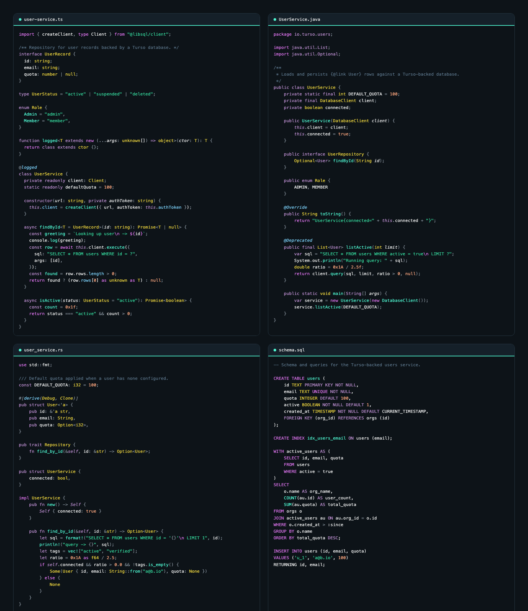
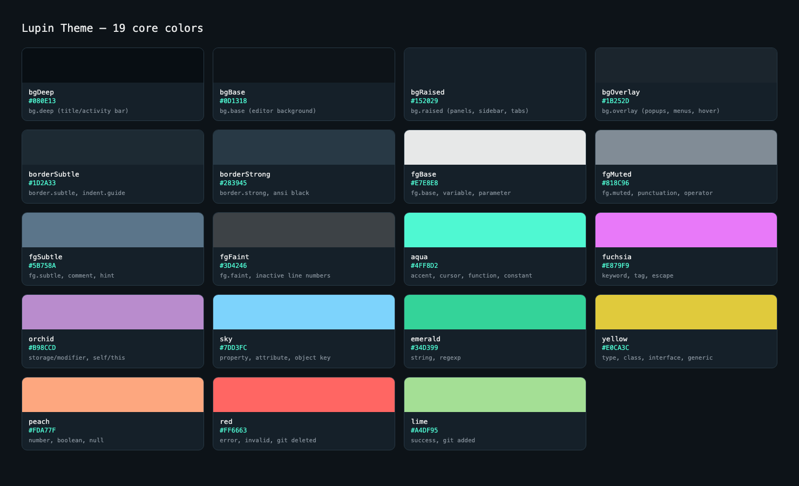

# Lupin Theme

Dark theme for VS Code and Zed, inspired by the code blocks on [turso.tech](https://turso.tech). Not affiliated with Turso.



## Why Lupin

- Colors lifted straight from turso.tech's own code blocks, not a guess at their brand.
- Calm near-black blue background (`#0D1318`), not pure black — less glare, more room to layer panels and popups.
- One saturated accent (aqua `#4FF8D2`) for cursor, functions and focus; everything else stays low-chroma so the accent actually means something.
- Tuned and tested across 23 languages, not just the two or three a theme author happens to write in.
- Every contrast and hue decision is a computed number, checked for deuteranopia and protanopia, not an eyeball call.

## Install

### VS Code

Build from source (no Marketplace listing yet):

```bash
npm ci && npm run package
```

Then either:

```bash
code --install-extension lupin-theme.vsix
```

(use `code-insiders` for VS Code Insiders), or open the Extensions panel → `...` menu → **Install from VSIX...**.

Then: `Preferences: Color Theme` → **Lupin Theme**.

### Zed

Command Palette → `zed: install dev extension` → select `extensions/zed`.

Then: `theme selector: toggle` → **Lupin Theme**.

> Marketplace, Open VSX and Zed registry publishing are coming — see Roadmap.

## Recommended fonts

Editor themes cannot set fonts. Lupin is tuned for Geist Mono (code) and Inter (UI, Zed only):

```bash
brew install --cask font-geist-mono font-inter
```

VS Code `settings.json`:

```json
{
  "workbench.colorTheme": "Lupin Theme",
  "editor.fontFamily": "'Geist Mono', Menlo, monospace",
  "editor.fontSize": 14,
  "editor.lineHeight": 1.6,
  "editor.fontLigatures": true,
  "terminal.integrated.fontFamily": "'Geist Mono'",
  "terminal.integrated.fontSize": 14
}
```

Zed `settings.json`:

```json
{
  "theme": "Lupin Theme",
  "buffer_font_family": "Geist Mono",
  "buffer_font_size": 14,
  "buffer_line_height": { "custom": 1.6 },
  "buffer_font_features": { "calt": true, "liga": true },
  "ui_font_family": "Inter",
  "ui_font_size": 15,
  "terminal": { "font_family": "Geist Mono" }
}
```

## Palette

19 core colors. Full numbers (OKLCH, WCAG, APCA) and the gates behind each choice: `docs/specs/01-palette.md`.



| Name | Hex | Role |
|---|---|---|
| bgDeep | `#080E13` | bg.deep (title/activity bar) |
| bgBase | `#0D1318` | bg.base (editor background) |
| bgRaised | `#152029` | bg.raised (panels, sidebar, tabs) |
| bgOverlay | `#1B252D` | bg.overlay (popups, menus, hover) |
| borderSubtle | `#1D2A33` | border.subtle, indent.guide |
| borderStrong | `#283945` | border.strong, ansi black |
| fgBase | `#E7E8E8` | fg.base, variable, parameter |
| fgMuted | `#818C96` | fg.muted, punctuation, operator, link uri |
| fgSubtle | `#5B758A` | fg.subtle, comment, hint, md quote |
| fgFaint | `#3D4246` | fg.faint, inactive line numbers |
| aqua | `#4FF8D2` | accent, cursor, function, method, constant, md heading |
| fuchsia | `#E879F9` | keyword (control, import, return), tag, escape |
| orchid | `#B98CCD` | storage/modifier, self/this, lifetime, label, preproc |
| sky | `#7DD3FC` | property, attribute/decorator, object key, md link text |
| emerald | `#34D399` | string, regexp, md inline code |
| yellow | `#E0CA3C` | type, class, interface, generic, warning |
| peach | `#FDA77F` | number, boolean, null/nil |
| red | `#FF6663` | error, invalid, git deleted |
| lime | `#A4DF95` | success, git added |

## Design principles

**Attention tiers** (contrast budget shrinks tier by tier): code + cursor > active state/feedback (selection, find, diagnostics) > navigation (sidebar, tabs, scrollbar) > chrome (title bar, status bar). If two elements in different tiers read with the same visual weight, the lower tier is wrong, not the higher one. Full element-by-element map: `docs/specs/02-attention-hierarchy.md`.

**Accent budget:** aqua is the single UI accent — cursor, active tab/view indicator, focus ring, primary button, active line number. Five spots, nowhere else. Chrome never carries accent.

**Syntax decisions:**
- Keyword (`if`, `return`, `import`, fuchsia) vs. modifier (`public`, `static`, `final`, orchid) — same hue family, modifier at ~half the chroma, so a Java signature doesn't turn into a wall of one color.
- Types (class, interface, generic) get their own hue, yellow — distinct from properties, so type-heavy code (Java, Rust, Go) still reads its shape.
- Numbers, booleans and null share peach — literal values, warm like strings but not text.
- Comments are tinted on the background hue, not neutral gray, and held to >= 3.88:1 — readable, still clearly receded.
- Italic is reserved for exactly four roles: parameter, `self`/`this`, attribute/decorator, markdown emphasis. Nothing else gets a second channel.

## Accessibility

- Code tokens >= 4.5:1, comments >= 3:1 (tuned to 3.88 on the editor background), UI text >= 4.5:1, secondary/indicator UI >= 3:1 — all WCAG 2.x on `bg.base`.
- Every syntax pair checked in OKLab ΔE, including simulated deuteranopia and protanopia (Machado 2009), not just normal vision.
- Known accepted exceptions:
  - `function` (aqua) vs. `variable` (fgBase) falls under the deuteranopia/protanopia threshold — fixing it would mean glare-level fg or dropping turso's own aqua; position (`name(`) disambiguates.
  - Comment contrast drops below 3:1 only under the three strongest selection/find fills — code itself stays >= 3:1 throughout.
  - Tritanopia separation on property/string is below target — tritanopia is ~0.01% prevalence and informative-only here; `:`/quotes separate key from value regardless.

## Languages tested

TypeScript, JavaScript, Java, Kotlin, C#, Python, Go, Rust, C, C++, PHP, Ruby, Swift, SQL, HTML, CSS, SCSS, JSON, YAML, TOML, Markdown, Shell, Dockerfile.

Dockerfile and Shell have sparse TextMate grammars — Dockerfile only colors instructions (command text stays `fg.base`), and shell arguments tokenize as strings. Both are exempted from the theme's "3+ hues per fixture" test gate for that reason.

## How it works

One palette, one generator per editor:

```
palette.ts  ->  roles.ts  ->  targets/{vscode,zed}.ts  ->  extensions/*/themes/*.json
(raw hex)       (semantic      (role -> editor key)        (generated, committed)
                 roles)
```

```
src/palette.ts         raw colors; the only file allowed to contain hex
src/roles.ts           semantic roles (bg.base, syntax.keyword, ...) -> palette entries
src/color.ts           WCAG contrast, OKLab deltaE, alpha compositing
src/targets/vscode.ts  roles -> VS Code theme object
src/targets/zed.ts     roles -> Zed theme family object (schema v0.2.0)
scripts/build.ts       writes target objects as JSON into extensions/
extensions/vscode/     package.json, themes/lupin-theme-color-theme.json
extensions/zed/        extension.toml, themes/lupin-theme.json
tests/                 one test file per src module
```

Never edit `extensions/*/themes/*.json` by hand — they're generated, and a test fails if they drift from `scripts/build.ts` output.

## Development

| Command | Does |
|---|---|
| `npm test` | vitest, coverage gate >90% on statements/branches/functions/lines |
| `npm run build` | regenerate `extensions/*/themes` from `src/` |
| `npm run preview` | writes `preview/index.html` with every language fixture rendered |
| `npm run typecheck` | `tsc --noEmit` |
| `npm run lint` | eslint, zero errors |
| `npm run package` | build the VS Code `.vsix` |

Specs: `docs/specs/` (research, palette, attention hierarchy, architecture). Plans: `docs/plans/`.

Test suite, one line each:

- `color.test.ts` — contrast/deltaE math against known reference values
- `palette.test.ts` — every gate in `01-palette.md`: contrast floors, hue separation, CVD
- `roles.test.ts` — every role resolves to a real palette entry
- `vscode.test.ts` — required workbench keys and TextMate scopes present, valid hex
- `zed.test.ts` — output validates against the vendored Zed schema v0.2.0
- `build.test.ts` — committed `extensions/*/themes/` match fresh build output
- `hex-only-in-palette.test.ts` — no hex literal outside `palette.ts`
- `languages.test.ts` — Shiki-tokenizes all 23 fixtures, checks role coverage and hue spread

## Roadmap

- JetBrains/WebStorm port.
- Publish to VS Code Marketplace, Open VSX and the Zed extension registry.
- Light variant (maybe).

## Credits

Inspired by the code blocks on [turso.tech](https://turso.tech). Not affiliated with Turso. No Turso logo is used.

Color-theory reference: the Dracula and Dracula Pro specifications — see `docs/specs/05-dracula-lessons.md` for what was adopted and what was changed.

## License

MIT © Emerson Silva
